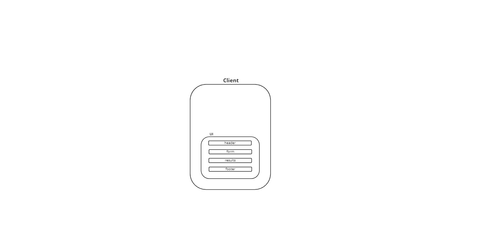

# RESTy API Testing Tool

## Overview:

> RESTy is a browser based API testing tool which allows a user to easily interact with APIs in a familiar interface.

## Author:

> Kellen Linse

## Built With:

- React.js
- Sass

## Getting Started:

- Clone the Repo:
  - `git clone https://github.com/Kellen-Linse/resty`

- Install NPM packages:
  - `npm install`

## Usage:

- To be filled out as usage is built out.

## Example Site:

- To be filled out as site goes live.

## UML:

- To be built out over the week.
- 