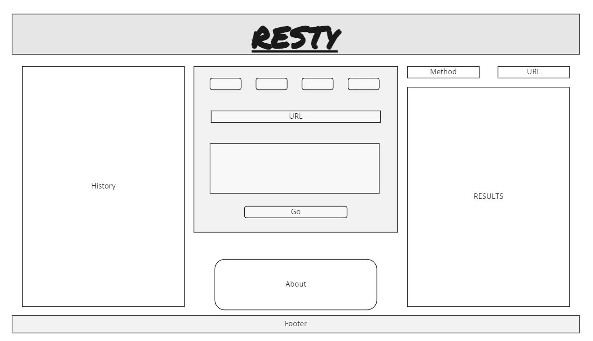

# RESTy API Testing Tool

## Overview:

> RESTy is a browser based API testing tool which allows a user to easily interact with APIs in a familiar interface. Build as a project for Code Fellows Javascript 401 to demonstrate React hooks, functional components, and deploying React apps with Github Pages.

## Author:

> Kellen Linse

## Built With:

- React.js
- Sass
- React JSON view
- React Spinner 
- Axios 
- Jest
- MSW

## Getting Started:

- Clone the Repo:
  - `git clone https://github.com/Kellen-Linse/resty`

- Install NPM packages:
  - `npm install`

- Run:
  - `npm start`

## Usage:

- Choose the method of request you would like.
- Enter URL for the API you wish to test
- If you choose `post` or `put`, enter the data from the body of your request in the text area that appears.
- Press the green button to send your request.
- Click on an item in your history to see past results.

## Example Site:

- [https://kellen-linse.github.io/resty/](https://kellen-linse.github.io/resty/)

## Wire Frame:

